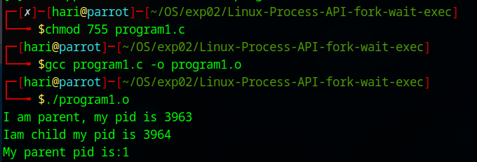
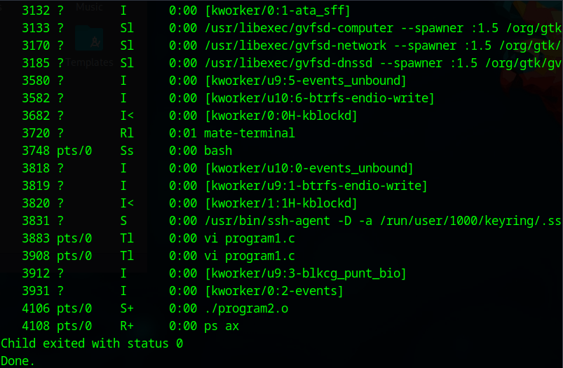

# Linux-Process-API-fork-wait-exec-
Ex02-Linux Process API-fork(), wait(), exec()
# Ex02-OS-Linux-Process API - fork(), wait(), exec()
Operating systems Lab exercise


# AIM:
To write C Program that uses Linux Process API - fork(), wait(), exec()

# DESIGN STEPS:

### Step 1:

Navigate to any Linux environment installed on the system or installed inside a virtual environment like virtual box/vmware or online linux JSLinux (https://bellard.org/jslinux/vm.html?url=alpine-x86.cfg&mem=192) or docker.

### Step 2:

Write the C Program using Linux Process API - fork(), wait(), exec()

### Step 3:

Test the C Program for the desired output. 

# PROGRAM:

## C Program to create new process using Linux API system calls fork() and getpid() , getppid() and to print process ID and parent Process ID using Linux API system calls


```
#include <stdio.h>
#include<stdlib.h>
#include <unistd.h>
int main()
{
  int pid;
  pid=fork();
  if(pid == 0)
  {
    printf("Iam child my pid is %d\n",getpid());
    printf("My parent pid is:%d\n",getppid());
    exit(0);
  }
  else
  {
    printf("I am parent, my pid is %d\n",getpid());
    exit(0);
  }
}

```


## OUTPUT





## C Program to execute Linux system commands using Linux API system calls exec() , exit() , wait() family


```
#include <unistd.h>
#include <stdio.h>
#include <stdlib.h>
#include <sys/wait.h>
#include <sys/types.h>

int main() {
    int status;
    pid_t pid;
    printf("Running ps with execl (without full path)\n");
    pid = fork();
    if (pid < 0) {
        perror("fork failed");
        exit(1);
    } 
    else if (pid == 0) {
        execlp("ps", "ps", "ax", NULL);
        perror("execlp failed");
        exit(1);
    } 
    else {
        wait(&status);
        if (WIFEXITED(status))
            printf("Child exited with status %d\n", WEXITSTATUS(status));
        else
            puts("Child did not exit successfully");
    }
    printf("\nRunning ps with execl (full path specified)\n");

    pid = fork();
    if (pid < 0) {
        perror("fork failed");
        exit(1);
    } 
    else if (pid == 0) {
        execl("/bin/ps", "ps", "ax", NULL);
        perror("execl failed");
        exit(1);
    } 
    else {
        wait(&status);
        if (WIFEXITED(status))
            printf("Child exited with status %d\n", WEXITSTATUS(status));
        else
            puts("Child did not exit successfully");
    }

    printf("Done.\n");
    exit(0);
}


```


## OUTPUT





# RESULT:
The programs are executed successfully.
